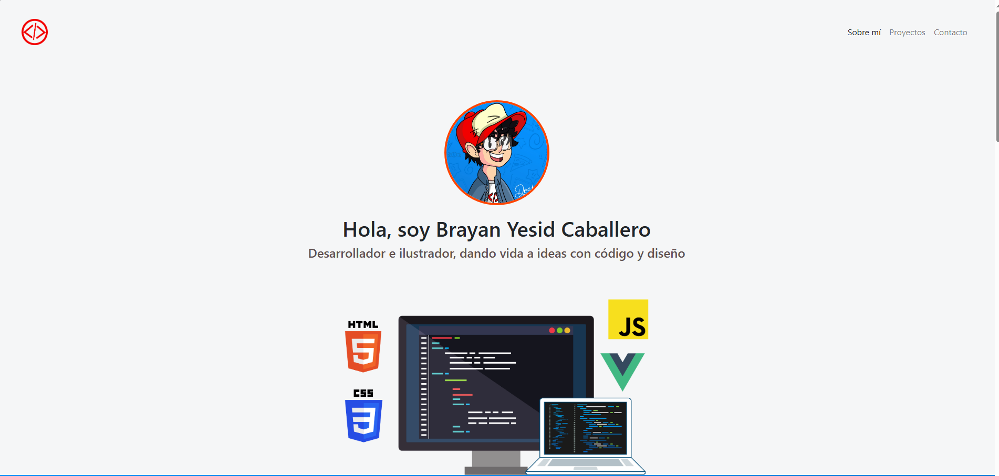
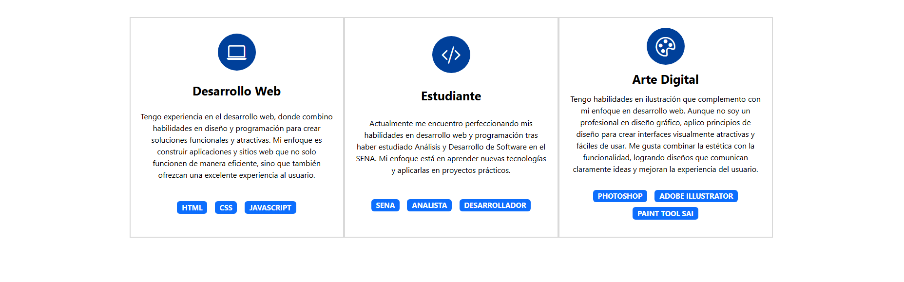
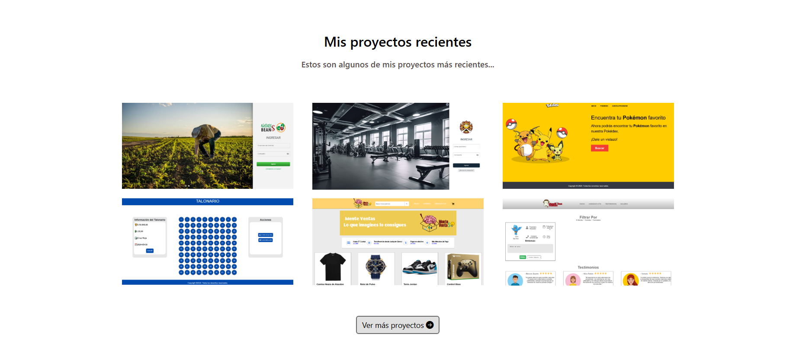

# Portafolio Brayan Yesid Caballero

Este es mi portafolio personal donde presento mis proyectos, experiencia y habilidades como desarrollador y diseñador, enfocado en ofrecer soluciones web funcionales y atractivas.

# CONTACTO

[Correo Electrónico](mailto:caballeroyesid7@gmail.com): caballeroyesid7@gmail.com
[Correo Institucional](mailto:bycaballero0@soy.sena.edu.co): bycaballero0@soy.sena.edu.co
[Cuenta GitHub](https://github.com/BrayanYes92338): BrayanYes92338
[Numero de Telefono](3219181484): Número de Celular

### Capturas de pantalla:

*Esta es la página principal de mi portafolio donde presento mi perfil.*

*Sección de experiencia donde detallo mis proyectos y habilidades.*

*Muestra de algunos de los proyectos que he desarrollado en el campo del desarrollo web.*

## Tecnologías

Esta página web fue creada con:

* HTML
* CSS
* JavaScript 
* Bootstrap 5

Además, se incluyeron **Google Fonts** para personalizar la fuente y **Bootstrap icons** para incorporar íconos como flechas y logos de redes sociales populares. 
